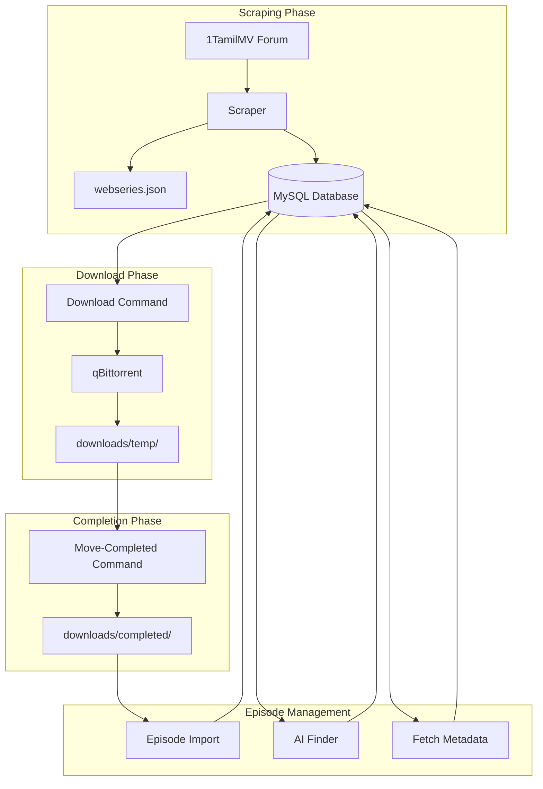
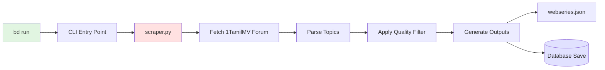
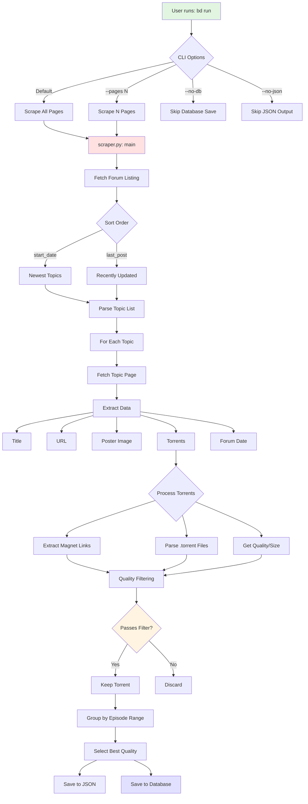
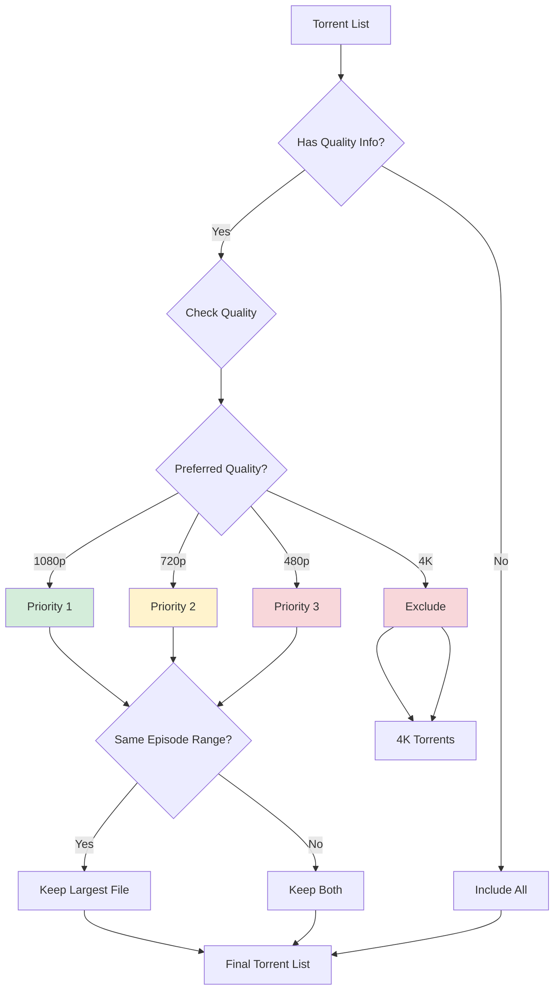
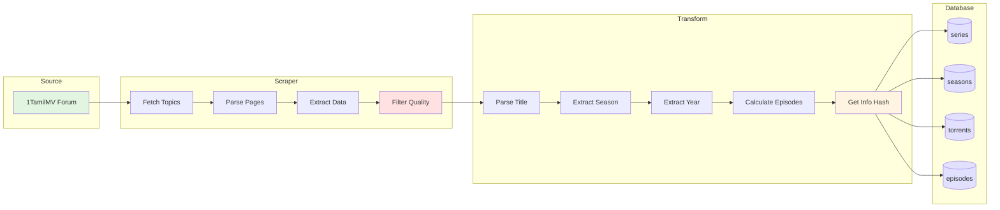
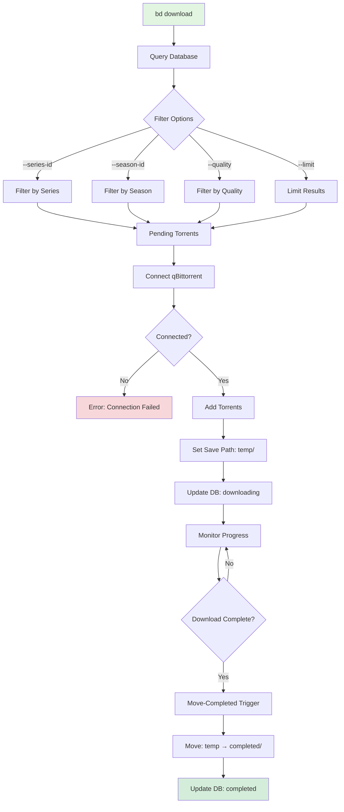
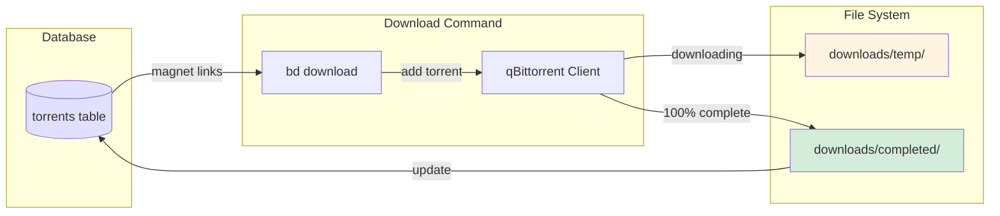
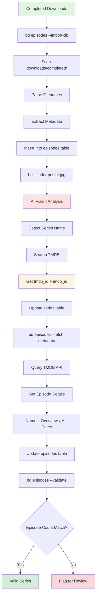
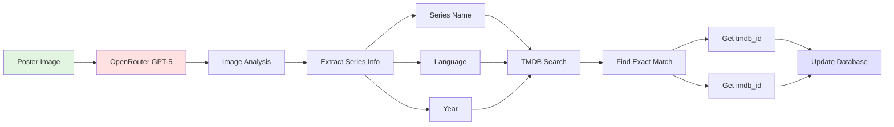
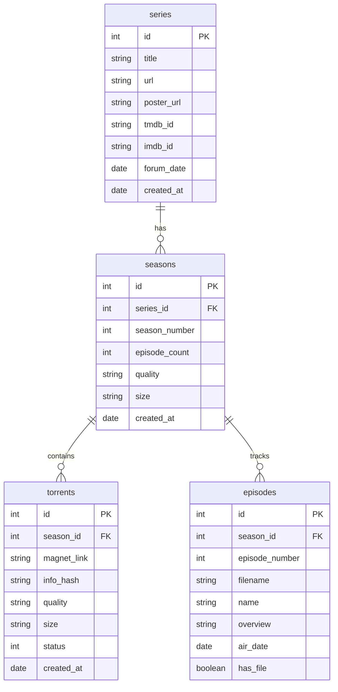

# Web Series Management - Complete Workflow Documentation

## Table of Contents
1. [System Overview](#system-overview)
2. [Scraping Workflow](#scraping-workflow)
3. [Download Workflow](#download-workflow)
4. [Episode Management Workflow](#episode-management-workflow)
5. [Database Schema](#database-schema)

---

## System Overview

---

## Scraping Workflow

### High-Level Scraping Flow

### Detailed Scraping Process

### Quality Filtering Logic

### Data Flow: Web to Database

---

## Download Workflow

### Download Process Flow

### qBittorrent Integration

---

## Episode Management Workflow

### Complete Episode Pipeline

### AI-Powered Series Identification

---

## Database Schema

### Tables and Relationships

### Status Values

| Table | Status | Meaning |
|-------|--------|---------|
| torrents | 0 | Pending download |
| torrents | 1 | Downloading |
| torrents | 2 | Completed |

---

## Quick Reference Commands

| Command | Purpose |
|---------|---------|
| `bd run` | Scrape forum and save to DB |
| `bd run --pages 5` | Scrape 5 pages only |
| `bd scrape --no-db` | Scrape to JSON only |
| `bd download` | Start downloads from DB |
| `bd download --quality 1080p` | Download 1080p only |
| `bd download --check-status` | Verify qBittorrent status |
| `bd move-completed` | Move finished downloads |
| `bd episodes --import-db` | Import files to episodes table |
| `bd --finder poster.jpg` | AI series identification |
| `bd episodes --fetch-metadata` | Get TMDB episode data |
| `bd episodes --validate` | Validate episode counts |

---

## File Locations

| Component | Path |
|-----------|------|
| Scraper | `Core Application/scraper.py` |
| CLI | `Core Application/cli.py` |
| Database | `Core Application/db.py` |
| Downloads | `downloads/temp/`, `downloads/completed/` |
| JSON Data | `data/webseries.json` |
| Config | `Configuration/config.yaml` |
